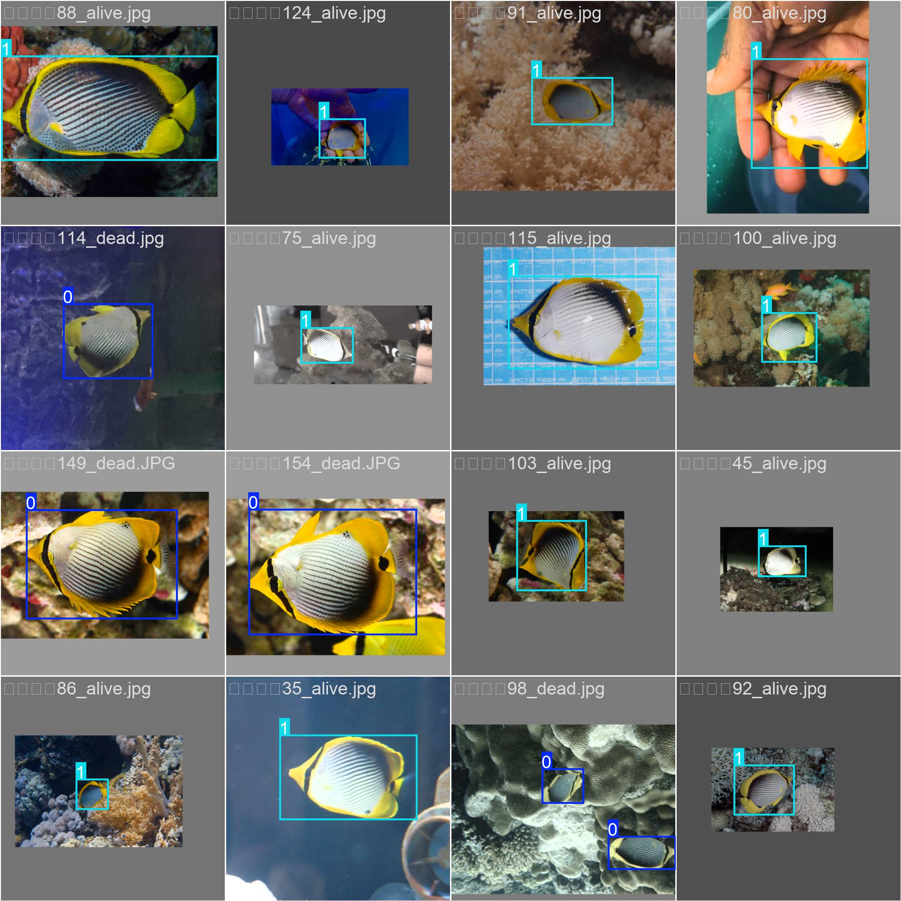
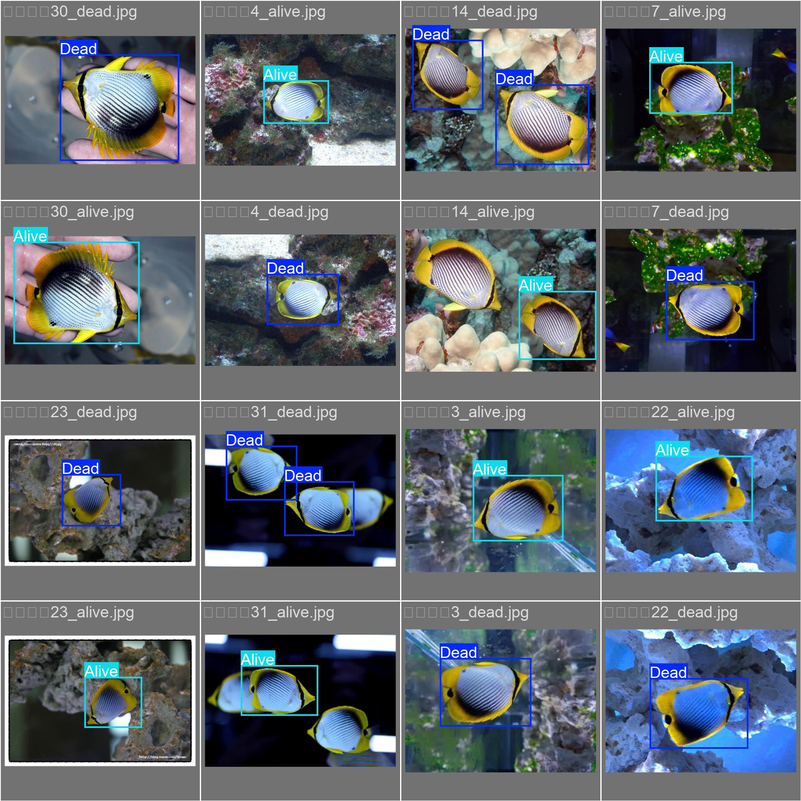

# 🐠 Kaquarium: Aquarium Fish Mortality Detection using YOLOv8

AI 기반 객체 인식으로 아쿠아리움 내 어류 폐사를 조기에 감지하여 연쇄 폐사 방지 및 관람객 만족도를 향상시키는 프로젝트입니다.

---

## 🎥 시연 영상

- [▶️ 객체 감지 시연 영상 1](https://youtu.be/HsOVlKPL_ks)
- [▶️ 객체 감지 시연 영상 2](https://youtu.be/eK_0NwUE2U8)

---

## 📊 학습 결과 시각화

| F1 Curve | 학습 이미지 샘플 | 검증 라벨 시각화 |
|----------|------------------|------------------|
|  |  |  |

---

## 🚀 기술 스택

- YOLOv8 객체 탐지
- OpenCV + Ultralytics
- Python / PyTorch
- 커스텀 데이터셋 라벨링 및 학습
- 실시간 폐사 감지 및 추론 시각화

---

## 📁 프로젝트 구성

```bash
kaquarium/
├── kaquarium.py           # 실행 코드
├── data.yaml              # YOLO 학습용 데이터 구성
├── f1_curve.png           # 학습 성능 시각화
├── train_batch0.jpg       # 학습 이미지 시각화
├── val_batch1_labels.jpg  # 검증 이미지 라벨 시각화
├── README.md              # 프로젝트 소개
└── ...
```
